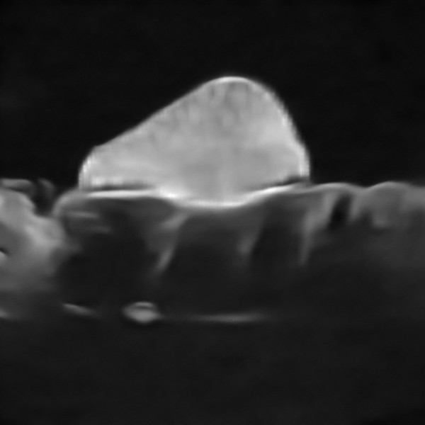
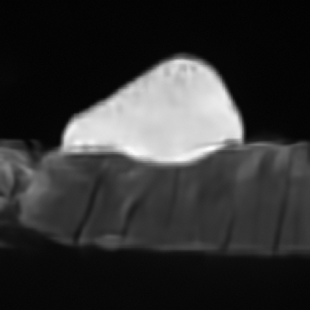
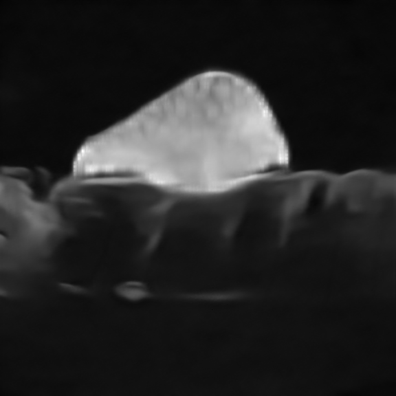

# Denoising Diffusion model with Proximal Alternating Linearized Minimization for image fusion

## Abstract
This repository presents the combination of two image fusion methods using magnetic resonance and ultrasound waves. The aim of merging these two medical imaging techniques is to combine their respective advantages (high resolution in ultrasound and absence of noise in MRI) while eliminating the disadvantages of each (low resolution in MRI and noise in ultrasound), in order to assist physicians in the diagnosis and treatment of diseases. The first method is an iterative alternating optimisation algorithm called Proximal Alternating Linearized Minimization (PALM) presented in **[1]**, whose implementation in Matlab is available on the Github repository [Fusion of Magnetic Resonance and Ultrasound Images for Endometriosis Detection](https://github.com/TLongin/Fusion-of-Magnetic-Resonance-and-Ultrasound-Images-for-Endometriosis-Detection). This method was initially developed to facilitate the detection and treatment of endometriosis. The second method is a diffusion model for multi-modality image fusion presented in **[2]**, whose Python implementation is available on the Github repository [Denoising Diffusion Model for Multi-modality Image Fusion](https://github.com/Zhaozixiang1228/MMIF-DDFM). This model has the same objective as the previous method (to preserve the advantages and remove the disadvantages of the modalities), but it is not specific to medical imaging. In the article, infrared images and night-time photographs are used as examples, with the aim of preserving the thermal structure of the infrared image as well as the fine details and textures of the photograph. Diffusion models are machine learning models, but they need to be guided by an iterative optimisation algorithm to successfully complete the fusion. The algorithm in question, used in **[2]**, is Expectation Maximisation (EM). Finally, the last part of this work is devoted to combining the two previous methods. We seek to observe what happens when the diffusion model is no longer guided by the Expectation Maximisation algorithm, but by the Proximal Alternating Linearised Minimisation algorithm. By merging these two models, we mainly aim to improve the performance of the Proximal Alternating Linearised Minimisation algorithm and the quality of the final result, i.e. to reduce costs and computation time while obtaining a result that is qualitatively identical or superior to that obtained without diffusion.

## Algorithm comparison

We use the same experimental data as described in **[1]** which you can find in the associated Github repository [Fusion of Magnetic Resonance and Ultrasound Images for Endometriosis Detection](https://github.com/TLongin/Fusion-of-Magnetic-Resonance-and-Ultrasound-Images-for-Endometriosis-Detection).

<p align="center">
  
  
</p>

Let us visualise the results of merging the two methods in order to compare them.

<p align="center">
  
  
</p>

The image fused with the PALM algorithm is on the left and the image fused with the DDFM algorithm is on the right. Note that it is necessary to resize the MRI image before performing the fusion. In the DFFM algorithm, the images are assumed to be of the same size.

Although it is clear that the DDFM model far surpasses PALM in terms of efficiency, it can be seen that the final result is qualitatively less satisfactory than that obtained with PALM. Indeed, although both images retain the contrasts associated with MRI, the image fused with PALM better preserves the high resolution of ultrasound, unlike the image fused with DDFM, which excessively favours the structure of MRI. We can deduce that the algorithm used for fusion in the diffusion process, namely Expectation Maximisation, is not sufficiently effective.  This algorithm was developed for the fusion of visible and infrared images, not for MRI and ultrasound images. We will therefore replace it with the PALM algorithm.

<p align="center">
  
  
</p>

Visually, it is difficult to differentiate between the two images. Let us compute some metrics.

| Metrics | PALM | DDFM - EM | DDFM - PALM |
|:---------------|:--------------:|:---------------:|:---------------:|
| EN         | 5.886         | 5.941         | 5.589 |
| SD       | 52.615       | 66.184       | 48.587 |
| MI       | 1.031       | 0.877       | 1.049|
| VIF      | 0.254       | 0.108       |0.261 |
| QAB/F      | -0.042       | 0.025       | -0.003|
| SSIM       | 0.908      | 0.873       | 0.912|


## Report
For further details regarding this work, please refer to the report [Fusion d'images par résonance magnétique et ultrasons](https://drive.google.com/drive/folders/1UrtJQBUryPRRbwraQZZrJzhzsJQ9_6RB?usp=sharing) (french version).

## Installation
We recommend following the instructions provided in the Github repository [Denoising Diffusion Model for Multi-Modality Image fusion](https://github.com/Zhaozixiang1228/MMIF-DDFM), as the original code (which we modified for our needs) comes from there **[2]**. Follow the instructions provided with the files given in our repository. Please note that we used Python version 3.12 and not 3.8. It is advisable to install the packages listed in the Github repository (`requirement.txt` file) one by one and not all at once with the command indicated :
```bash
pip install requirements.txt
```
without specifying the version so that any dependency issues between different packages are automatically resolved. This process is long and tedious, but it is the only way to ensure that all of the packages have the correct versions, without dependency issues.

## Usage
If you want to infer with our DDFM-PALM model and obtain the fusion results in the report, please run in a Jupyter Notebook (or Jupyter Lab) :
```python
!python sampleTLSE.py
```
Or in a command terminal :
```bash
python sampleTLSE.py
```
**Warning** : Please note that the use of a GPU (or GPU cluster) is required.

## Proximal Alternating Linearized Minimization in Python
The Python implementation of the PALM algorithm is a translation of a Matlab code available [here](https://github.com/TLongin/Fusion-of-Magnetic-Resonance-and-Ultrasound-Images-for-Endometriosis-Detection). As Matlab and Python are two programming languages with certain specific features, we had to implement certain Matlab functions that are not available in Python. These functions are contained in the file `matlab_tools` where we used the GitHub [ResizeRight](https://github.com/assafshocher/ResizeRight) repository to implement the Matlab `resize` function in Python. The checkpoint to use DnCNN model and the code are from the GitHub [DnCNN Pytorch](https://github.com/SaoYan/DnCNN-PyTorch) repository and the `fspecial` function has been directly translated from Matlab. If you want to experiment PALM algorithm for image fusion, please run the file `PALM/palm_main.py`. The `PALM` folder contains only the Python implementation of the PALM algorithm and is completely separate from the DDFM model.

## References
**[1]**  Oumaima El Mansouri, Fabien Vidal, Adrian Basarab, Pierre Payoux, Denis Kouamé, and Jean-Yves Tourneret. Fusion of magnetic resonance and ultrasound images for endometriosis detection. IEEE Transactions on Image Processing, 2020.  [Github repository](https://github.com/TLongin/Fusion-of-Magnetic-Resonance-and-Ultrasound-Images-for-Endometriosis-Detection)

**[2]** Zixiang Zhao, Haowen Bai, Yuanzhi Zhu, Jiangshe Zhang, Shuang Xu, Yulun Zhang, Kai Zhang, Deyu Meng, Radu Timofte, and Luc Van Gool. Ddfm : Denoising diffusion model for multi-modality image fusion, 2023. [Github repository](https://github.com/Zhaozixiang1228/MMIF-DDFM)

## Citations
If you use the code or dataset, please cite the papers as below :
```bibtex
@misc{zhao2023ddfmdenoisingdiffusionmodel,
      title={DDFM: Denoising Diffusion Model for Multi-Modality Image Fusion}, 
      author={Zixiang Zhao and Haowen Bai and Yuanzhi Zhu and Jiangshe Zhang and Shuang Xu and Yulun Zhang and Kai Zhang and Deyu Meng and Radu Timofte and Luc Van Gool},
      year={2023},
      eprint={2303.06840},
      archivePrefix={arXiv},
      primaryClass={cs.CV},
      url={https://arxiv.org/abs/2303.06840}, 
}

@article{9018380,
  author={El Mansouri, Oumaima and Vidal, Fabien and Basarab, Adrian and Payoux, Pierre and Kouamé, Denis and Tourneret, Jean-Yves},
  journal={IEEE Transactions on Image Processing}, 
  title={Fusion of Magnetic Resonance and Ultrasound Images for Endometriosis Detection}, 
  year={2020},
  volume={29},
  number={},
  pages={5324-5335},
  keywords={Spatial resolution;Magnetic resonance imaging;Image fusion;Diseases;Magnetic resonance;Image fusion;magnetic resonance imaging;ultrasound imaging;super-resolution;despeckling;proximal alternating linearized minimization},
  doi={10.1109/TIP.2020.2975977}}
```
